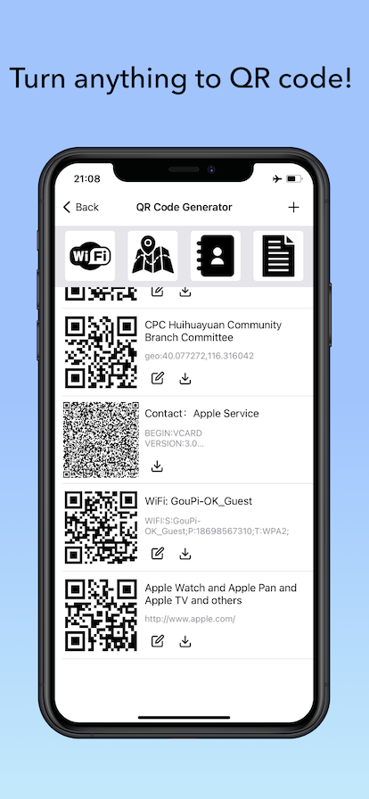
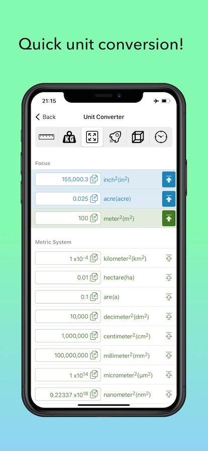
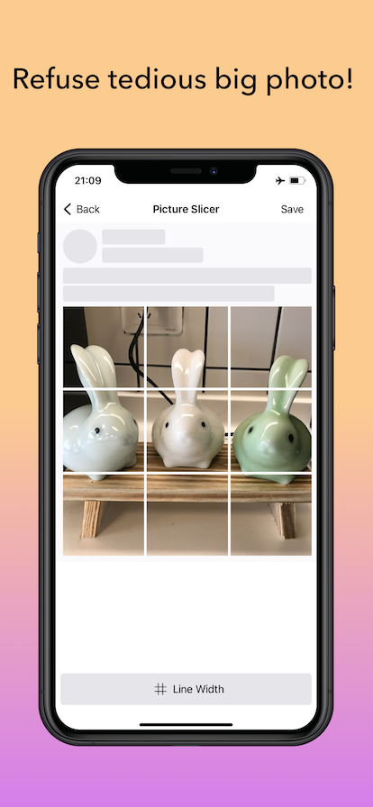
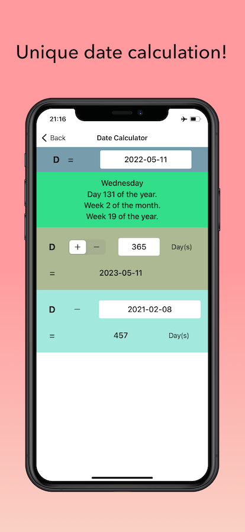
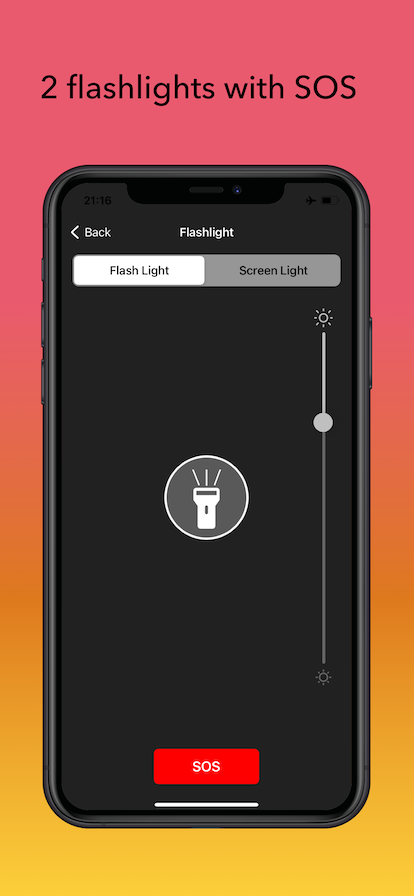
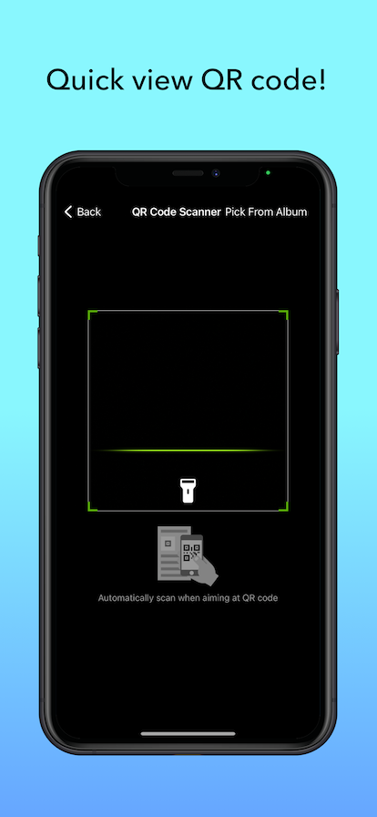
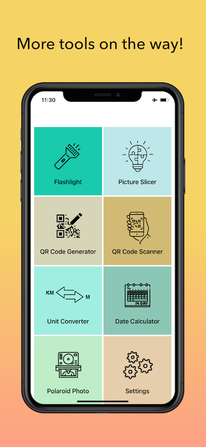

# Toolbox Tech Support

## App Introduce

Toolbox is a free App of frequently-used tools.
The size is small so that you can keep it on your phone and find it anytime you need!
Tools：
 - QRCode Create: Connect WiFi QRCode, Contact QRCode, Location QRCode, Text QRCode
 - QRCode Scan: View QRCode content, Open QRCode link
 - Unit Convert: Length, Weight, Area, Speed, Volumn, Time
 - Data Calculate: Number of days, Date plus or minus
 - Picture Slice: 9/6/4/3 slices
 - Flashlight: Flash-Light, Screen-Light, SOS
 - Polaroid Photo: Turn normal 6inch photos to Polaroid-Style photos. Create your own Photo Wall.

## Download

AppStore：[Toolbox - Free Common Tools](https://apps.apple.com/app/id1622330151)

## Contact Me

Please contact chuangyi0128@gmail.com
